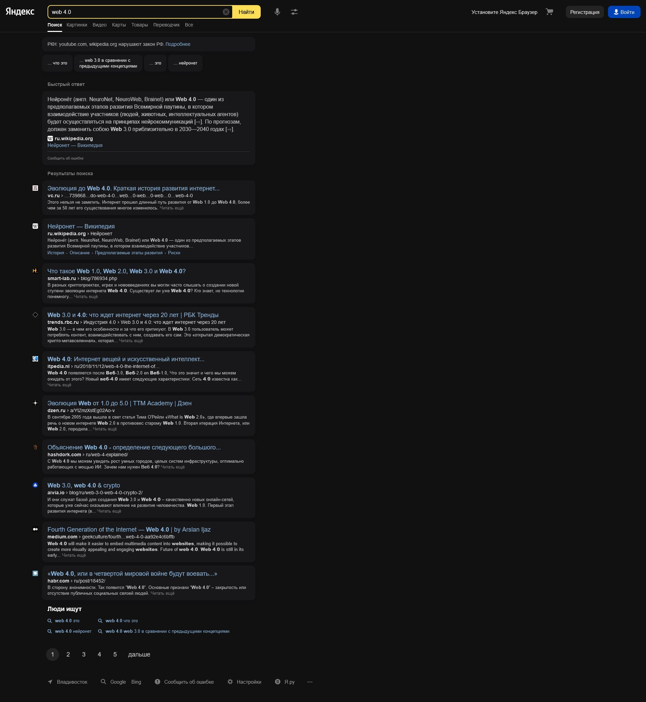
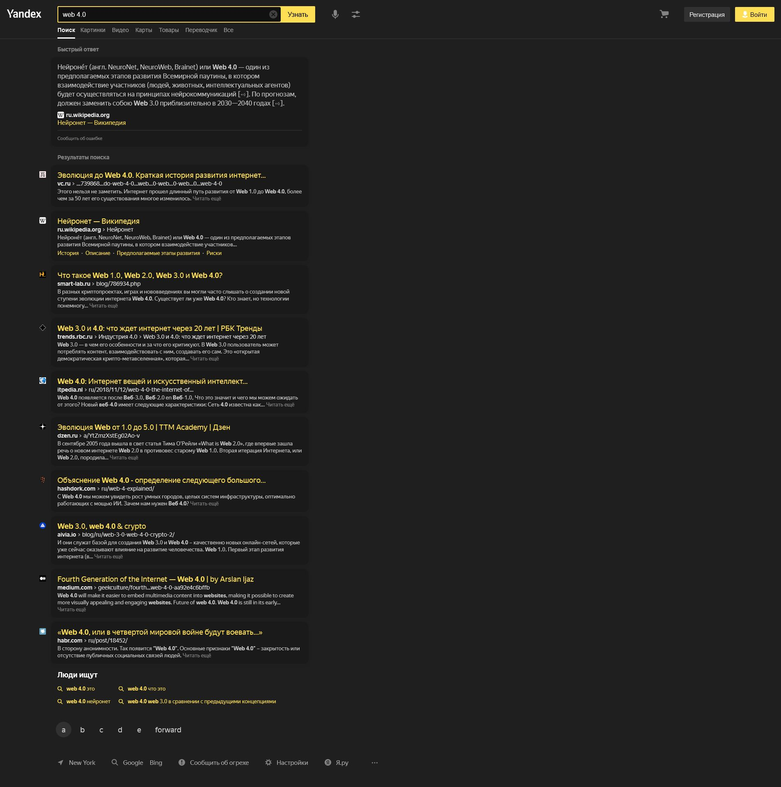
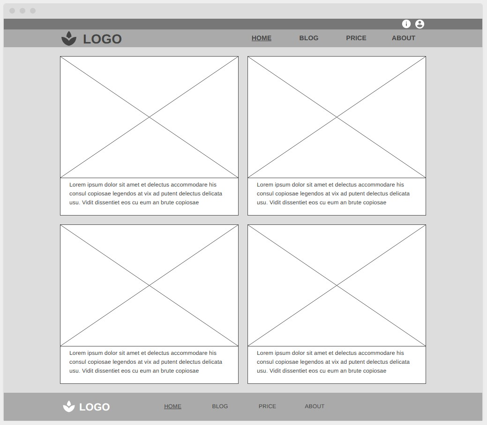

# Знакомство с веб-технологиями

### Урок 1. Веб-технологии: вчера, сегодня, завтра

Задача: на основе сайта yandex.ru:
1. Определите, на каком протоколе работает сайт.
   * Сайт работает на протоколе https. 
2. Проанализируйте структуру страницы сайта.
   * Header сайта содержит логотип, поисковую строку, дополнительные настройки поиска, кнопки входа и регистрации на сайте.
   * Body сайта отображает ссылки на сайты с небольшим описанием соответствующие поисковому запросу,
     поисковые подсказки и пагинацию. Второй колонкой иногда отображается быстрый ответ на поисковой запрос.
   * Footer содержит дополнительные ссылки на сервисы компании, ссылки альтернативных поисковиков, настройки и ссылки связанные с деятельностью компании. 
3. Внесите не менее 10 изменений на страницу с помощью инструмента разработчика и представьте скриншоты было/стало.  
    Скриншот №1 (Было):
    

    Скриншот №2 (Стало):
    
4. Создайте прототип низкой детализации (дополнительное задание, если на семинаре дошли до задания №8).
    
